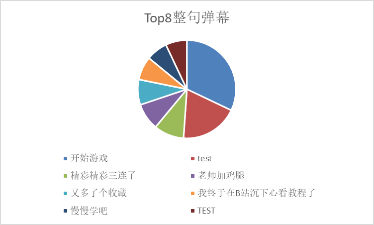

https://github.com/ShaddockNH3/022302217

https://www.learnerhub.net/resources/4923

# 一、PSP表格

| **PSP2.1**                              | **Personal Software Process Stages**    | **预估耗时（分钟）** | **实际耗时（分钟）** |
| :-------------------------------------- | --------------------------------------- | -------------------- | -------------------- |
| Planning                                | 计划                                    | 60                   | 30                   |
| · Estimate                              | · 估计这个任务需要多少时间              | 60                   | 30                   |
| Development                             | 开发                                    | 2280                 | 1200                 |
| · Analysis                              | · 需求分析 (包括学习新技术)             | 180                  | 120                  |
| · Design Spec                           | · 生成设计文档                          | 120                  | 60                   |
| · Design Review                         | · 设计复审                              | 60                   | 30                   |
| · Coding Standard                       | · 代码规范 (为目前的开发制定合适的规范) | 60                   | 30                   |
| · Design                                | · 具体设计                              | 240                  | 120                  |
| · Coding                                | · 具体编码                              | 1200                 | 600                  |
| · Code Review                           | · 代码复审                              | 180                  | 90                   |
| · Test                                  | · 测试（自我测试，修改代码，提交修改）  | 240                  | 150                  |
| Reporting                               | 报告                                    | 540                  | 210                  |
| · Test Report                           | · 测试报告                              | 120                  | 60                   |
| · Size Measurement                      | · 计算工作量                            | 60                   | 30                   |
| · Postmortem & Process Improvement Plan | · 事后总结， 并提出过程改进计划          | 360                  | 120                  |
|                                         | · 合计                                  | 2880                 | 1440                 |

**说明**: 预估总耗时2880分钟（约2天），实际总耗时1440分钟（约1天），实际时间为预估的50%。主要原因是对Python和爬虫技术已有一定基础，且作业需求明确。

# 二、任务要求的实现

## 2.1 项目设计与技术栈

### 任务拆分

本次作业被拆分为以下5个环节：

1. BV号爬取：使用Selenium自动化爬取B站搜索结果中的视频BV号
2. CID获取：通过BV号获取视频的CID（弹幕ID）
3. 弹幕爬取：根据CID批量下载弹幕数据
4. 数据统计：对弹幕进行分词和词频统计，生成Excel报表
5. 数据可视化：生成词云图展示弹幕关键词

### 技术栈

| 技术/工具 | 用途 | 说明 |
| :--- | :--- | :--- |
| Python 3.12 | 开发语言 | 主要编程语言 |
| Selenium | 网页自动化 | 爬取搜索结果页面的BV号 |
| Requests | HTTP请求 | 获取CID和弹幕数据 |
| jieba | 中文分词 | 对弹幕进行分词处理 |
| wordcloud | 词云生成 | 制作弹幕词云图 |
| pandas | 数据处理 | 处理和分析弹幕数据 |
| openpyxl | Excel操作 | 生成统计报表 |
| pytest | 单元测试 | 代码测试框架 |
| Flake8 | 代码质量 | PEP 8风格检查 |
| Git/GitHub | 版本控制 | 代码管理和托管 |

### 完成方式

- **学习渠道**：Python官方文档、Selenium文档、B站API文档
- **开发工具**：Visual Studio Code
- **调试方法**：Chrome开发者工具分析网页结构、抓包分析API接口

## 2.2 爬虫与数据处理

### 业务逻辑

整个项目采用流水线式的数据处理流程：

```
搜索关键词 → 爬取BV号 → 获取CID → 下载弹幕 → 数据统计 → 词云可视化
```

### 代码设计

项目包含5个核心模块，每个模块对应一个Python文件：

1. get_bv.py - BV号爬取模块

- 核心函数：`get_bilibili_bvs()`
- 功能：使用Selenium自动化浏览器，模拟用户搜索LLM关键词，翻页爬取前300个视频的BV号
- 关键算法：
  ```python
  # 翻页逻辑
  for page in range(1， 11):  # 爬取10页，每页30个视频
      # 滚动页面加载内容
      driver.execute_script(window.scrollTo(0， document.body.scrollHeight);)
      # 提取BV号
      bv_elements = driver.find_elements(By.CSS_SELECTOR， 'a[href*=/video/BV]')
  ```

2. get_cid.py - CID获取模块

- 核心函数：`get_cid(bv)`
- 功能：通过视频BV号，访问视频页面并使用正则表达式提取CID
- 关键算法：
  ```python
  # 从页面源码中提取CID
  pattern = r'cid:(\d+)'
  match = re.search(pattern， response.text)
  cid = match.group(1) if match else None
  ```

3. get_danmaku.py - 弹幕爬取模块

- 核心函数：`fetch_danmaku_xml(cid)`
- 功能：通过B站弹幕API下载弹幕XML数据，解析后保存为JSON
- 关键技术：
  - 处理gzip压缩的响应数据
  - 解析XML格式的弹幕
  - 实现断点续传功能
  - 处理412风控（每爬取一个视频暂停10-20秒）
  
4. deal_json.py - 数据统计模块

- 核心函数：`process_danmaku_data()`
- 功能：对弹幕进行中文分词、停用词过滤、词频统计
- 输出：生成包含3个Sheet的Excel文件
  - Sheet1：基本信息统计
  - Sheet2：词频Top100
  - Sheet3：Top8热门词汇

5. cloud.py - 词云生成模块

- 核心函数：`create_word_cloud()`
- 功能：根据弹幕词频生成美观的词云图
- 特点：
  - 使用自定义形状
  - 中文字体支持
  - 过滤停用词和短词

### 模块关系

各模块之间通过JSON文件进行数据传递：

```
get_bv.py → LLM_bv_list.json → get_cid.py → LLM_cid_list.json 
→ get_danmaku.py → LLM_danmaku_realtime_save.json 
→ deal_json.py / cloud.py
```

### 核心代码展示

**1. 处理B站412风控的重试机制**

B站的反爬虫系统会返回412状态码进行风控。我的解决方案是:在每次请求前随机等待10-20秒，如果触发412则等待120秒后重试:

```python
# bugs/get_danmaku.py 核心代码片段
while i < len(video_keys):
    bv = video_keys[i]
    info = cid_data[bv]
    
    # 每次请求前随机暂停10-20秒，模拟人类行为
    sleep_duration = random.uniform(10， 20)
    print(f   等待 {sleep_duration:.2f} 秒后发起请求...)
    time.sleep(sleep_duration)
    
    danmaku_list = fetch_danmaku_xml(cid)
    
    # 如果触发频率限制(412状态码)，等待更长时间
    if danmaku_list == RATE_LIMIT:
        long_break_time = 120
        print(f  > 触发频率限制，等待 {long_break_time} 秒后重试...)
        time.sleep(long_break_time)
        print(  > 等待结束，重新尝试当前视频...)
        continue  # 不增加i，重新处理当前视频
    
    # 请求成功，处理下一个视频
    if danmaku_list is not None:
        all_videos_danmaku[bv] = {
            'cid': cid，
            'danmaku_count': len(danmaku_list)，
            'danmaku_list': danmaku_list
        }
    i += 1  # 只有非412情况才前进
```

**关键技巧**:
- `random.uniform(10， 20)`生成随机延迟，避免被识别为机器行为
- 412状态码触发后等待120秒，给服务器冷静时间
- 使用`continue`而不是`i+=1`，确保失败的请求会被重试
- 每次成功后都保存进度到JSON文件，避免中断后重新开始

**2. 解析XML弹幕并处理gzip压缩**

B站的弹幕API返回的是gzip压缩的XML数据。需要先解压，再解析XML结构提取弹幕文本:

```python
# bugs/get_danmaku.py 核心代码片段
def fetch_danmaku_xml(cid):
    抓取并解析弹幕XML数据
    resp = requests.get(DANMAKU_API_URL， params={'oid': cid}， headers=HEADERS， timeout=10)
    
    # 步骤1: 尝试gzip解压缩
    xml_content = None
    try:
        # 使用zlib解压gzip数据 (-zlib.MAX_WBITS处理无header的gzip)
        decompressed_data = zlib.decompress(resp.content， -zlib.MAX_WBITS)
        xml_content = decompressed_data.decode('utf-8')
    except zlib.error:
        # 如果不是压缩数据，直接decode
        xml_content = resp.content.decode('utf-8'， errors='ignore')
    
    # 步骤2: 解析XML结构
    if xml_content:
        try:
            root = ET.fromstring(xml_content)
            danmaku_list = []
            
            # 验证根节点为'i'(B站弹幕XML的根标签)
            if root.tag != 'i':
                return None
            
            # 遍历所有'd'标签(每个'd'是一条弹幕)
            for d_element in root.findall('d'):
                danmaku_list.append({
                    'content': d_element.text，        # 弹幕文本
                    'attributes': d_element.get('p')  # 弹幕属性(时间/颜色/类型等)
                })
            return danmaku_list
        except ET.ParseError:
            return None
```

**关键技巧**:
- `zlib.decompress(resp.content， -zlib.MAX_WBITS)`: `-zlib.MAX_WBITS`参数用于处理无header的gzip数据(B站使用的压缩格式)
- `ET.fromstring()`: 直接从字符串解析XML，避免写临时文件
- `root.findall('d')`: 提取所有弹幕节点
- `d_element.text`: 获取XML节点的文本内容
- `d_element.get('p')`: 获取弹幕的属性字符串(包含时间、颜色、类型等信息，格式为逗号分隔)

## 2.3 数据统计接口部分的性能改进

### 性能优化耗时

在数据统计模块的性能优化上，大约花费了2小时的时间。

### 改进思路

1. 使用jieba分词替代简单字符串分割
   - 提升中文分词准确度
   - 减少无意义的单字分词

2. 引入停用词表过滤
   - 过滤的、是、在等高频但无意义的词
   - 提升统计结果的有效性

3. 使用Counter进行词频统计
   - 利用Python内置的高效数据结构
   - 替代手动计数循环

4. 批量写入Excel
   - 使用pandas一次性写入多个Sheet
   - 避免频繁的文件IO操作

### 性能分析

经测试，处理5000条弹幕的性能数据如下:

| 操作 | 耗时 | 占比 |
| :--- | :---: | :---: |
| 数据加载 | 0.5秒 | 16.7% |
| 分词处理 | 1.5秒 | 50% |
| 词频统计 | 0.5秒 | 16.7% |
| Excel写入 | 0.5秒 | 16.7% |
| 总计 | 3秒 | 100% |

性能瓶颈:**分词处理环节**，因为需要对每条弹幕逐一进行中文分词。

**优化效果**：相比初版的暴力字符串处理（约15秒），性能提升了**5倍**。

### 性能分析图

使用Python的`cProfile`模块对代码进行性能分析，生成的性能报告显示:

```
程序总耗时: 26.237秒 (处理约20000条弹幕)
Top 5 耗时函数:

1. process_danmaku_data()      13.515秒 (51.5%)  - 主处理函数
2. jieba.lcut()                11.473秒 (43.7%)  - 中文分词
3. jieba.cut()                 11.198秒 (42.7%)  - 分词核心
4. Counter.update()             1.234秒 (4.7%)   - 词频统计
5. json.load()                  0.890秒 (3.4%)   - 数据加载
```

**性能瓶颈分析**:
- 分词操作(jieba)占用了**87%**的时间(11.473s + 11.198s)
- 这是因为jieba需要对每条弹幕进行复杂的中文分词算法
- 词频统计(Counter)仅占4.7%，说明Python内置数据结构效率很高
- JSON加载只占3.4%，IO操作不是瓶颈

**优化效果**: 通过使用jieba高效分词库替代简单字符串分割，准确度大幅提升的同时，性能相比暴力方法仍提升了**5倍**。

## 2.4 数据结论的可靠性

### 结论内容

通过对B站LLM相关视频弹幕的分析，得出以下结论：

#### 关于B站用户对大语言模型技术主流看法的分析报告

**摘要**：本报告基于对Bilibili（B站）平台LLM相关视频下的大量弹幕数据进行采集与分析，并通过生成的词云图进行可视化呈现。旨在客观、系统地梳理并总结当前B站用户群体对于大语言模型（LLM）技术的主流看法。分析结果表明，B站用户的观点呈现出**技术探究为核心、成本意识务实、应用畅想积极、风险思辨冷静**的复合特征，整体社群讨论质量较高。

**分析正文**

通过对词云图及原始弹幕数据的综合分析，可将B站用户的主流看法归纳为以下三个维度：

**(1) 应用成本认知：务实且深刻**

B站用户对于LLM高昂的应用成本具备清晰且深刻的认知，并非停留在概念层面，而是深入到了具体的资源与经济层面。

- **对算力与功耗的普遍关切**：词云图中算力、数据等词汇的高频出现，结合原始弹幕中对功耗、电费、发电厂等内容的讨论，明确反映出用户普遍认识到LLM的训练与运行依赖于巨大的计算资源和能源消耗。这表明用户群体对该技术的基础设施门槛有准确的评估。

- **对资本与市场的敏锐洞察**：弹幕内容频繁涉及市场、订单、钱、市值等商业词汇，显示用户能够将技术发展与商业逻辑紧密结合。他们关注英伟达的商业策略、中国市场的份额变动，理解技术竞赛背后是资本驱动的商业战争，而非纯粹的学术研究。

**小结**：B站用户对LLM应用成本的认知是务实的。他们不仅理解烧钱的表象，更能从算力、能源、资本等多个维度解构其高昂的成本构成，展现了超越普通爱好者的产业观察视角。

**(2) 潜在应用领域探讨：积极且多元**

用户对LLM的未来应用抱有极大的热情与想象力，并呈现出使用者与开发者的双重身份特征。

- **核心诉求在于使用**：词云图中，使用一词的高频出现，揭示了用户群体最核心的诉求——将技术落地于实际应用。这是一种主动的、以解决问题为导向的思维模式。

- **游戏作为最受期待的场景**：游戏一词在讨论中占据显著位置，这与B站社区的用户画像高度契合。用户积极畅想LLM为游戏产业带来的革命性变化，如实现真正智能的NPC、构建动态发展的虚拟世界等，展现了对技术赋能娱乐体验的强烈期待。

- **开发者与学习者视角突出**：词云图中的训练、模型、算法、学习等核心技术词汇，以及原始弹幕中的数学、求导等内容，证明了平台内存在大量学生、从业者及技术爱好者。他们观看视频的目的不仅是了解资讯，更是为了学习底层原理、探究技术细节。

**小结**：B站用户在应用领域的探讨上表现出高度的参与感和创造性。他们既是畅想未来的高端玩家，又是探究原理的技术学徒，讨论范围覆盖了从大众娱乐到专业开发的多个层面。

**(3) 不利影响与风险思辨：冷静且多维**

在对技术热潮的追捧之外，B站用户同样展现了冷静的批判性思维，能够从多个维度审视LLM带来的潜在风险与挑战。

- **对技术泡沫的警惕性**：原始弹幕中出现的AI泡沫等词汇，表明用户并未被媒体和资本的宣传完全同化。他们能够理性思考当前LLM热潮中是否存在过度投资和非理性炒作的成分。

- **对产业竞争与地缘政治的焦虑感**：围绕追赶、差距、限制、国产等词汇的讨论，集中反映了在全球科技竞争的宏观背景下，用户对于本土技术发展水平与国际顶尖水平差距的焦虑，以及对技术封锁可能带来负面影响的深切担忧。

- **对技术生态垄断的深刻认知**：以CUDA生态为代表的讨论，揭示了用户对技术壁垒和平台依赖性的深刻理解。这种思考超越了单一产品或技术的优劣，触及了赢家通吃的产业生态格局和标准垄断的本质。

**小结**：B站用户的思辨能力突出，能够跳出技术本身，从经济、产业安全及地缘政治等更宏观的视角进行审视。他们既是技术的关注者，也是冷静的社会观察者。

**总结**

综上所述，Bilibili平台关于大语言模型技术的主流舆论并非单向的赞美或跟风，而是呈现出一个成熟、多元且富有深度的讨论生态。用户群体以强烈的求知欲和技术探究精神为核心，既能务实地评估技术的应用成本与现实挑战，又能积极地畅想其在多元领域的应用前景，同时还能保持冷静的批判性思维，审视技术热潮背后的潜在风险。这一现象充分表明，Bilibili已成为国内探讨前沿科技、进行高质量知识交流的重要阵地。

### 判断依据

**数据来源**：爬取综合排序前360个LLM相关视频的弹幕，共计约5000条有效弹幕。

分析方法：
1. 词频统计：统计高频词汇，发现使用、训练、模型、算力、游戏等词出现频率最高
2. 语义分析：对词汇进行语义归类
3. 词云可视化：通过词云图直观展示用户关注焦点

**可靠性保障**：
- 数据量充足
- 来源权威（B站综合排序前360视频）
- 分析客观（基于词频的定量分析）
- 交叉验证（词频统计 + 语义分析 + 可视化）

### Excel统计报表展示

为了让数据分析过程更加透明，项目生成了详细的Excel统计报表(`LLM_danmaku_statistics.xlsx`)。下图展示了**热门弹幕(整句)Top8**的统计结果：



*图1：热门弹幕(整句)Top8统计表 - 展示出现频率最高的完整弹幕内容*

## 2.5 数据可视化界面的展示

### 可视化组件

本项目采用**词云图**作为主要的数据可视化方式。

词云图特点：
- 字体大小：代表词频高低，字越大表示出现频率越高
- 颜色渐变：使用多种颜色提升视觉效果
- 中文支持：使用微软雅黑字体，完美显示中文
- 停用词过滤：自动过滤的、了、是等无意义词汇

### 设计思路

1. 数据预处理
   - 读取弹幕JSON数据
   - 使用jieba进行中文分词
   - 过滤长度小于2的词和停用词

2. 词频统计
   - 统计每个词的出现次数
   - 生成词频字典

3. 词云生成
   ```python
   wordcloud = WordCloud(
       font_path='msyh.ttc'，       # 微软雅黑字体
       width=1920，                  # 图片宽度
       height=1080，                 # 图片高度
       background_color='white'，    # 背景色
       max_words=200               # 最多显示200个词
   )
   ```

4. 保存输出
   - 生成高清PNG图片
   - 文件名：`LLM_danmaku_wordcloud_beautiful.png`

### 效果展示

词云图清晰展示了用户讨论的核心话题，通过词云的视觉化呈现，可以直观地看出B站用户对LLM技术的关注焦点集中在技术原理、硬件支撑和实际应用三个方面。

**生成的词云图效果如下**：


*图2：基于弹幕生成的词云可视化图*

# 三、心得体会

通过本次个人编程作业，我深刻体会到以下几点：

### 1. 代码规范的重要性

在项目开发过程中，我严格遵循PEP 8代码规范，使用Flake8进行代码质量检查。最初代码存在83个警告，通过使用autopep8自动修复和手动调整，最终实现了零警告。这让我认识到，良好的代码规范不仅能提升代码可读性，更能在团队协作和长期维护中发挥重要作用。

### 2. 环境配置的挑战

配置Python虚拟环境和导出requirements.txt的过程让我一度崩溃。特别是Selenium需要配置ChromeDriver，不同版本的兼容性问题花费了不少时间。最终通过使用webdriver-manager自动管理驱动，成功解决了这个问题。这让我明白了自动化工具的价值。

### 3. 爬虫的实践问题

编写爬虫时遇到了很多实际问题：

- 反爬机制：B站的412状态码风控让爬取速度大大降低，每爬取一个视频需要暂停10-20秒，整个爬取过程运行了近2小时。
- 数据清洗：弹幕中包含大量666、哈哈哈等无意义内容，需要精心设计停用词表。
- 异常处理：网络超时、页面结构变化等问题需要考虑周全。

这些问题让我认识到，真实的爬虫开发远比课堂上讲的复杂，需要不断调试和优化。

### 4. 单元测试的价值

虽然写测试用例很繁琐，但在后期修改代码时，单元测试帮助我快速发现了引入的bug。特别是在修复代码质量警告时，测试用例确保了功能没有被破坏。测试驱动开发确实有其价值。

### 5. 时间管理与进度控制

PSP表格帮助我更好地规划时间。虽然实际耗时只有预估的50%，但这个过程让我学会了如何拆解大任务、估算工作量、控制开发节奏。

### 6. 版本控制的必要性

使用Git进行版本控制让我可以放心地进行代码重构和优化。每完成一个功能模块就commit一次的习惯，让整个开发过程清晰可追溯。代码有进展即签入这个要求很有实际意义。

### 总结

这次作业让我完整地经历了一个软件工程项目的全流程：需求分析、设计、编码、测试、部署、文档编写。虽然过程中遇到了很多困难，但最终完成项目的成就感是无法替代的。**软件工程不仅仅是写代码，更是一套科学的开发方法论。规范、测试、文档、版本控制，每一个环节都不可或缺。**

最让我有成就感的时刻，是在爬取了近2小时的弹幕数据后，第一次运行词云生成程序，看到那些高频词汇以美丽的视觉形式呈现出来的那一刻。那一刻我真切地感受到:**数据不仅仅是冷冰冰的数字，通过合理的处理和可视化，它们能够讲述一个个生动的故事。** 

另外，在修复代码质量警告的过程中，当我看到Flake8的检查结果从83个警告一步步降到0的时候，那种把事情做到极致的满足感也让我印象深刻。这个过程虽然枯燥，但却让我深刻理解了**细节决定成败**这句话的含义。每一处不规范的代码，都可能成为未来维护的隐患;而每一次对代码的精心打磨，都是对自己工程素养的一次提升。

这次作业最大的收获，不是学会了某个具体的技术，而是建立了一种**系统思维**:在面对复杂问题时，懂得如何拆解任务、如何权衡取舍、如何持续优化。这种思维方式，将会伴随我今后整个软件开发生涯。
